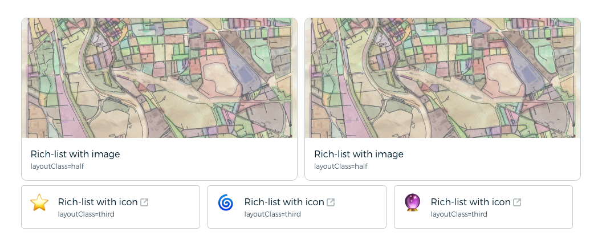

## Rich-list Shortcode



The richlist shortcode is designed to create a customizable rich list item, ideal for showcasing various types of content such as links, list item, card for article. It supports options for displaying icons, images, titles, and subtitles, allowing for versatile usage in your projects.

### Parameters

- **icon:** The icon to display alongside the list item. Often uses for output emoji in short version.
- **image:** The URL of the image to display alongside the list item. Image place to the top of the item and convert it to card
- **layoutClass:** (Optional) Additional CSS classes to customize the layout of the rich list item. Supports various layout classes (`half`, `third`, `inline-block`) for flexible positioning within your content.
- **listLink:** (Optional) The URL the rich list item should link to. If link starts with http - there will arrear external-link indicator and link will open in new window.
- **linkAttr:** (Optional) Additional attributes to be added to the anchor tag.
- **listTitle:** The main title or headline of the rich list item.
- **listSubtitle:** A brief subtitle or description associated with the rich list item.

### Example Usage

To use the richlist shortcode, include the desired parameters within the shortcode tag as follows:

```html

```

This will generate a rich list item with the specified icon, image, title, and subtitle. If a link is provided, the entire item will be clickable.

### Additional Notes

- Ensure that any images referenced in the shortcode are accessible and properly sized for display.
- Utilize the `linkAttr` parameter for adding custom attributes to the anchor tag, such as `target="_blank"` for opening links in a new tab.
- Take advantage of the provided Sass code to customize the styling of the rich list items according to your project's design requirements.
